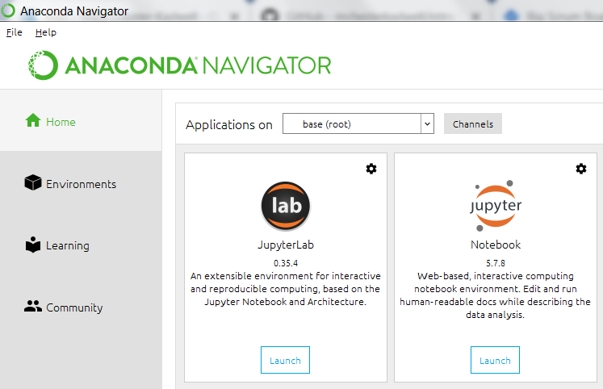
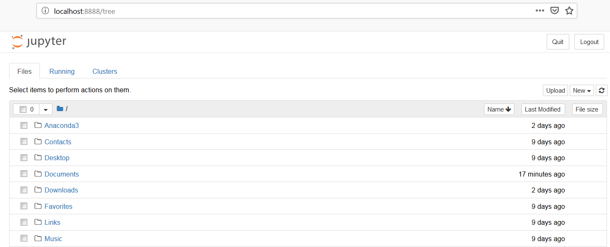
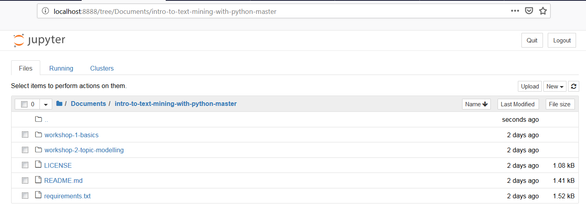
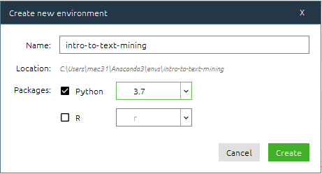
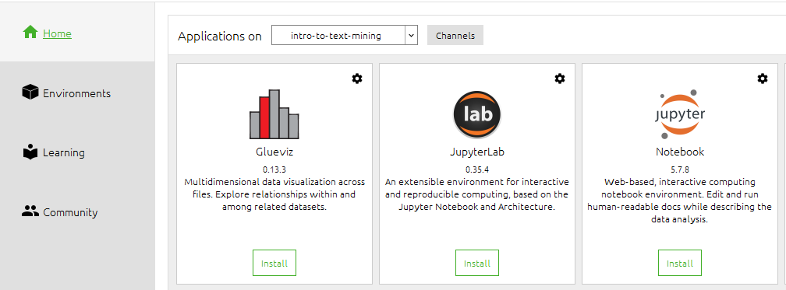
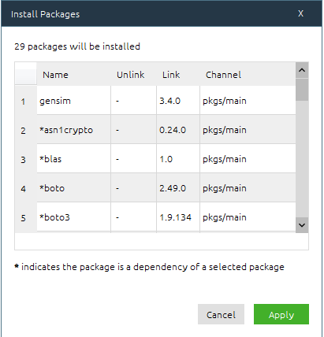

# Introduction to Text-Mining with Python

## Introduction

This repository contains Jupyter notebooks used for teaching the Cambridge 
Digital Humanities *'Introduction to Text-Mining with Python'*, a series of two 
workshops in the Cambridge Digital Humanities Learning programme 2019.

The notebooks are designed to present material for face-to-face teaching and to 
be a resource for participants to review after the workshops have finished. They 
are also written as stand alone notebooks for anyone to follow and use as they 
wish.

Some of the sections are marked with the words 'going further'. This is 
extension material that we skipped over during the workshops but which is a 
source of deeper exploration into the topics for anyone with further interest 
or more experience.

**Status: Notebooks are ready for use. Please file bug reports and suggestions 
in Issues.**
 
## Code Details

The aim of the code in this repository is to show basic text-mining techniques 
to participants who are complete beginners to both text mining and coding. 
As such, the notebooks are designed to be run as a teaching aid, not as a 
serious text analysis tool.

The main libraries used in this repository are:
* [Natural Language Toolkit](https://www.nltk.org/) (NLTK)
* [SpaCy](https://spacy.io/) (a bit)
* [Gensim](https://radimrehurek.com/gensim/)
* [pyLDAvis](https://github.com/bmabey/pyLDAvis)
* [Matplotlib](https://matplotlib.org/)

## Quick Start: Launch Notebooks Online

The easiest way to run the Jupyter notebooks in this repository is to click on 
the Binder button above. This will launch a virtual environment in your 
browser where you can open and run the notebooks without installing anything.

## Running Notebooks on Your Own Computer (Beginners)

These instructions are suitable if you have never installed Jupyter Notebooks 
or Python on your own computer before.

### Install Jupyter Notebooks and Python with Anaconda 

[Install Anaconda (Python 3.7)](https://www.anaconda.com/distribution/#download-section). 

Pick the version appropriate for your operating system (Windows, Mac, Linux). 
Make sure you choose ‘Python 3.7’ (not ‘Python 2.7’). 

Once it has installed, [open Anaconda Navigator](http://docs.anaconda.com/anaconda/user-guide/getting-started/#open-navigator).

### Download the Notebooks from GitHub 

Go to the [GitHub page](https://github.com/mchesterkadwell/intro-to-text-mining-with-python ) 
where this code repository is kept. For a simple download, click the ‘Clone or 
download’ green button, then pick 'Download ZIP'.

Open the ZIP file that is downloaded. In most operating systems this will 
 automatically unzip it back into individual files. Move the folder to 
 somewhere you want to keep it, such as 'My Documents'. 

(The more advanced method is to use git to clone the repository, but we won’t 
cover that here.)

### Quick Start: Run a Notebook Quickly in the Default (root) Environment 

In simple terms, an environment is like an isolated box in which to run a 
notebook safe from interference by other notebooks. Anaconda provides one 
default environment, called ‘root’, in which to get up and running quickly. 
However, you should really make a new environment for each project (which may 
have one or more related notebooks). See **Run Notebooks in a Dedicated 
Environment** below. 

For a quick start, you can run the notebooks in the ‘root’ environment. 

In **Anaconda Navigator > Home** there is a card for Jupyter Notebook (not 
JupyterLab). Click on the 'Launch' button. 

This opens a web page at **http://localhost:8888/tree** that shows your whole file 
system.  

Navigate to where you downloaded the notebooks, and click on one to run it in 
the usual way. 

#### Important Note about Required Packages 

Many of the required packages (dependencies) for running these notebooks are 
included with the Anaconda ‘root’ environment. However, several libraries like 
`gensim` and `spacy` are not included. This means that some of the notebooks 
might not fully work in the ‘root’ environment. 

To install these packages you should create a new environment and install them 
there (see next section). 

### Recommended: Run Notebooks in a Dedicated Environment 

In **Anaconda Navigator > Environments** click on the ‘Create’ button in the 
bottom of the Environments list. 

Type a name e.g. 'intro-to-text-mining', make sure that 'Python' is _checked_ 
and under the dropdown pick '3.7'. Make sure that 'R' is left _unchecked_. 

Then click the ‘Create’ button. 

It will take a few seconds to set up...

With your new environment selected, go back to **Anaconda Navigator > Home**, 
and click the 'Install' button for Jupyter Notebook (not JupyterLab). 

Then in **Anaconda Navigator > Environments** make sure you have selected your 
new environment. You will see a long list of new packages that have been installed. 

Go to the dropdown that says ‘Installed’ and change it to ‘All’. Then click in 
the ‘Search Packages’ search box and type ‘gensim’. 

Tick the box on the left of ‘gensim’ and click the green ‘Apply’ button in the 
bottom right-hand corner. 

A box will pop up that tells you a number of packages will be installed. 
Click ‘Apply’. It will take a while to install the packages. 

Repeat this process for the following packages: `nltk`, `spacy`, `matplotlib`.  

Unfortunately, `pyldavis` (used for visualising the topic models) is not 
easily available this way and we have to open the command line to install this. 

On the right of the environment name is a small green play arrow. Click on it 
and pick ‘Open in Terminal’ from the dropdown. 

In the terminal that opens type: 

`conda install -c conda-forge pyldavis`

When the prompt asks you to confirm, type ‘y’ for yes. 

Finally, you can go to **Anaconda Navigator > Home** and click the Jupyter 
Notebooks ‘launch’ button and navigate to the notebooks. 

 

 

  

